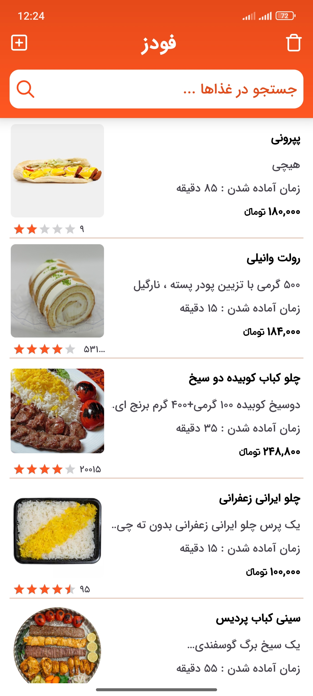
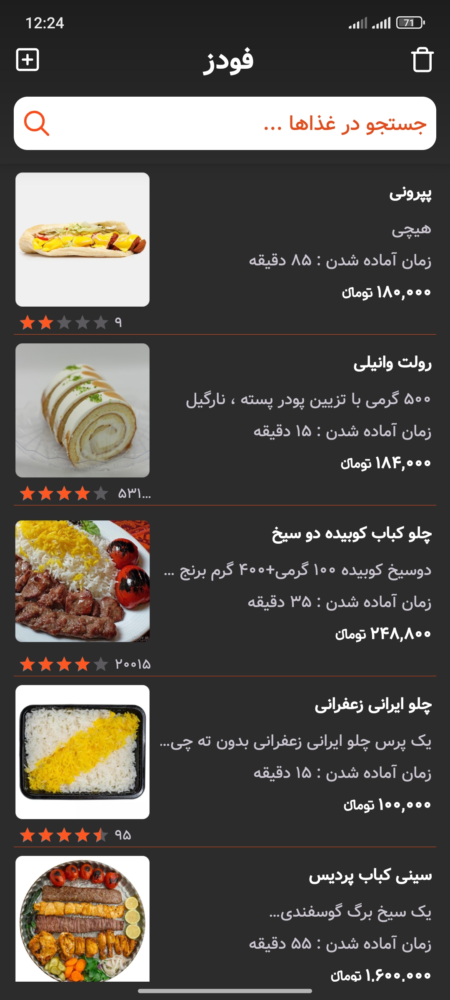
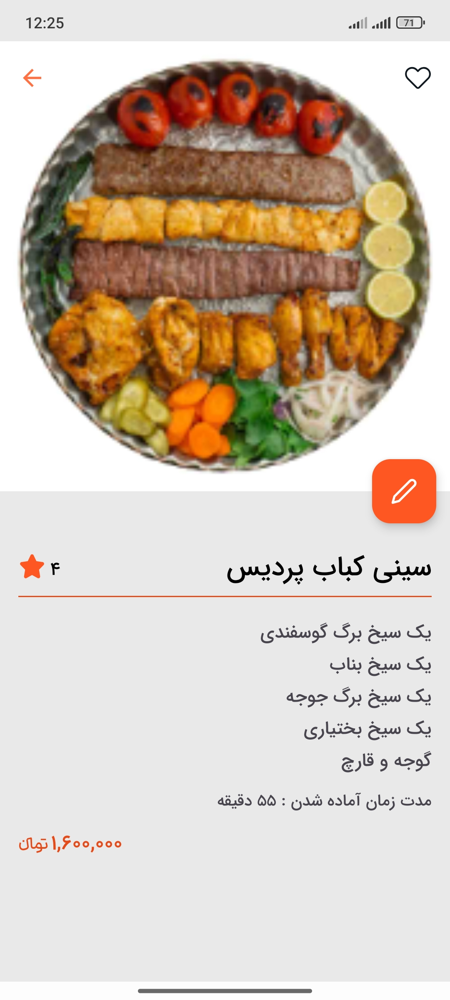
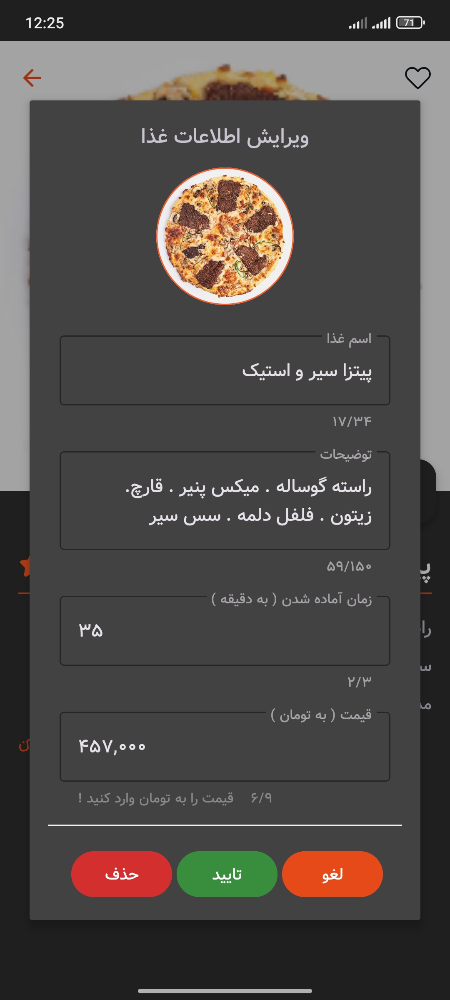

# Foods App 🍔🍕

🌐 [English](README.md) | [فارسی](README.fa.md)

A simple demo application for introducing and browsing foods, built with **Kotlin**, **XML**, and **MVP** (Model-View-Presenter) architecture.

## 🎯 Project Goal

This project is designed as a demo to showcase the following skills:
- Implementing a clean, layered **MVP** architecture.
- Using **Kotlin** as the main programming language.
- Designing the UI with **XML** following Android best practices.
- Better code management by separating layers and using design patterns.

## ✨ Features

- ✅ Display a list of foods.
- ✅ View details of each food on a separate page.
- ✅ Separated architecture (Model-View-Presenter) for better testability and readability.
- ✅ Clean and maintainable code with Kotlin.

## 🛠 Technologies & Tools

| Area | Technology |
| :--- | :--- |
| Programming Language | Kotlin |
| Architecture | MVP (Model-View-Presenter) |
| User Interface | XML |
| Min SDK | 24 (Android 7) |
| IDE | Android Studio |

## 📸 Pictures

| Light Mode | Dark Mode |
|--|--|
|  |  |
|  |  |
